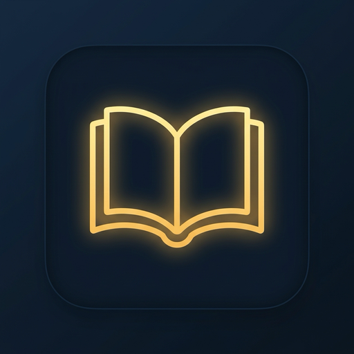

# Evening Reading (晚读)

<p align="center">
  
</p>

<p align="center">
  一款专注于提供纯粹、沉浸式体验的跨平台桌面阅读软件，附带高质量的有声伴读功能。
</p>

## ✨ 特性

- **极简主义设计**：无边框阅读区，段落间智能留白与悬浮操作栏，提供如纸质书般纯净的视觉体验。
- **智能解析与目录**：强大的正则表达式引擎，精准切分小说章节并自动生成右侧导航目录。
- **多平台编码兼容**：智能探针自动识别 GBK 与 UTF-8 编码，完美兼容各类 TXT 文本，告别乱码。
- **全自动跟读 (TTS)**：内置基于 Rust 代理的高质量 Edge-TTS 引擎，提供流畅的人声朗读，段落级高亮跟随。
- **跨平台原生性能**：基于 Tauri 2.0 与 React 构建，同时支持 macOS (Intel / Apple Silicon) 和 Windows，包体小巧，内存占用极低。

## 🚀 下载与安装

请前往 [Releases 页面](https://github.com/Linya-IronMan/evening-reading/releases) 下载最新版本的安装包：

- **macOS (M1/M2/M3)**: 下载 `evening-reading_*_aarch64.dmg`
- **macOS (Intel)**: 下载 `evening-reading_*_x64.dmg`
- **Windows**: 下载 `evening-reading_*_x64-setup.exe`

> **注意 (macOS)**：如果遇到“文件已损坏，无法打开”的拦截提示（Gatekeeper），请将 App 拖入应用程序（Applications）文件夹，然后在终端中执行以下命令去除隔离标签：
> ```bash
> sudo xattr -rd com.apple.quarantine /Applications/evening-reading.app
> ```

## 🛠️ 本地开发

### 环境依赖
- Node.js (>= 20)
- pnpm (>= 9)
- Rust (>= 1.75.0)

### 运行步骤

1. 克隆代码仓库：
   ```bash
   git clone https://github.com/Linya-IronMan/evening-reading.git
   cd evening-reading
   ```

2. 安装前端依赖：
   ```bash
   pnpm install
   ```

3. 启动本地开发服务：
   ```bash
   pnpm dev
   ```

4. 构建发版（需要本地拥有对应平台的构建工具链）：
   ```bash
   pnpm build
   ```

## 📝 发版工作流 (Maintainers)

本仓库集成了全自动的版本号同步、Changelog 生成与 Github Actions 构建流程。

```bash
# 自动生成 Changelog，同步版本，打上新 Tag
pnpm run release

# 推送代码及 Tag，自动触发打包流程
git push --follow-tags origin main
```

## 📄 许可

MIT License
